# Little Lemon iOS Capstone Project

### Video of App Features

The below video shows a walkthrough of the app and it's features.  
Click play on the below video to view the app features:

https://github.com/robcodehub/littlelemon/assets/50296456/ce17f36f-19aa-4540-ab52-11973b39fab6

## About the Brand

Little Lemon is a charming neighborhood bistro that serves simple food and classic cocktails in a lively but casual environment.  
The restaurant features a locally-sourced menu with daily specials.

## User Journey Map and Persona

### Persona
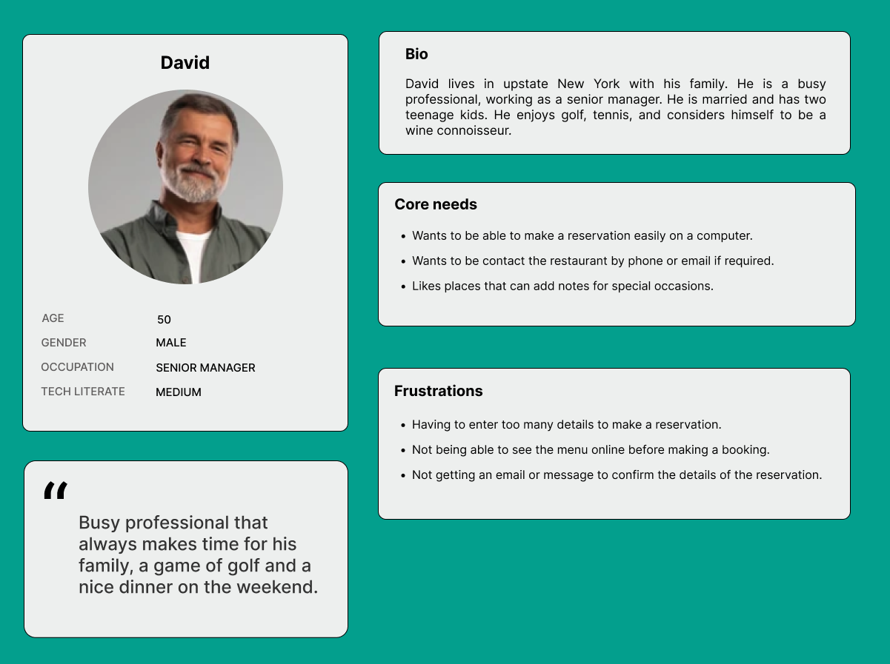

### Customer Journey Map
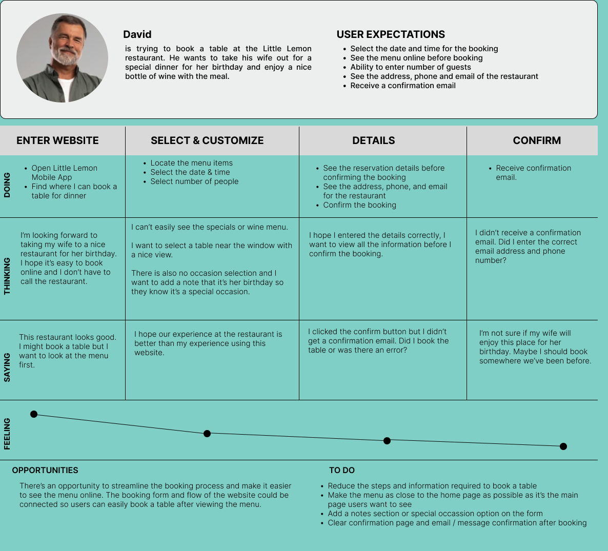

## Wireframes

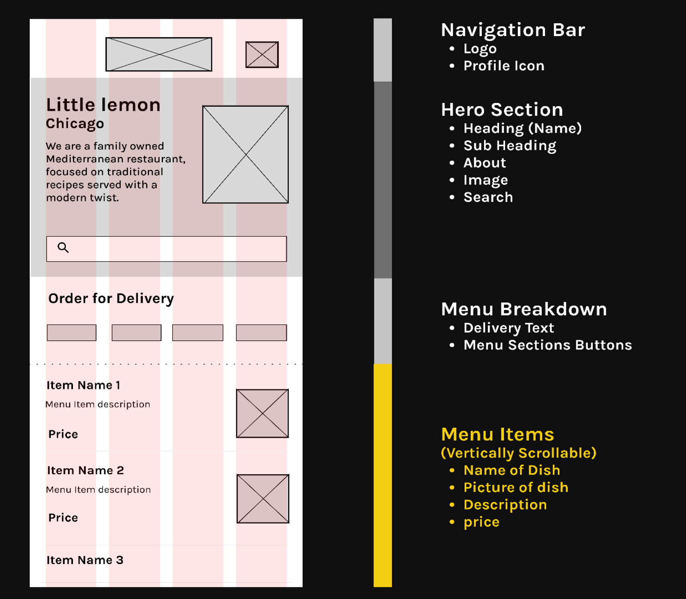

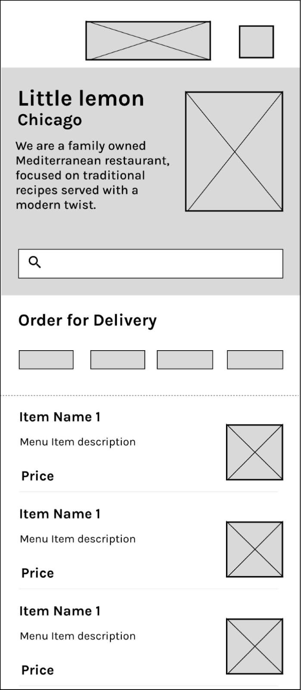

## Style and Brand Guidelines

### Logo guide
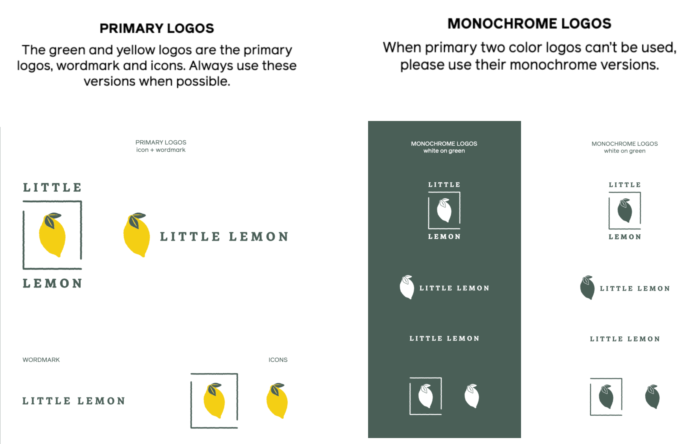

### Color Palette
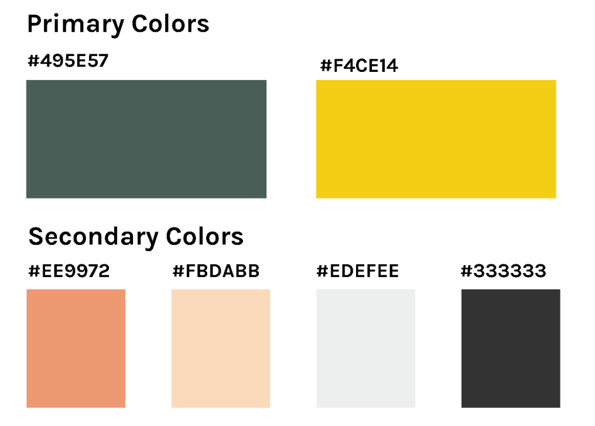
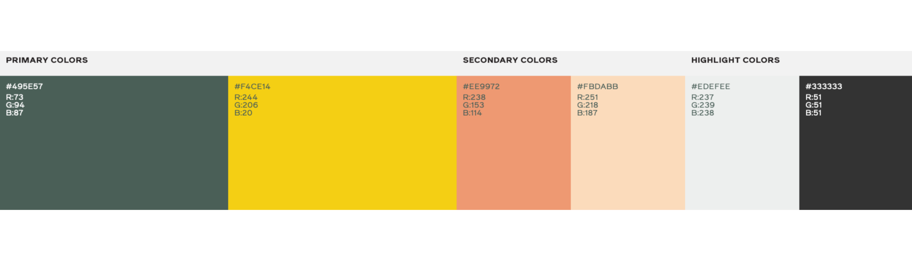

### Typography
| 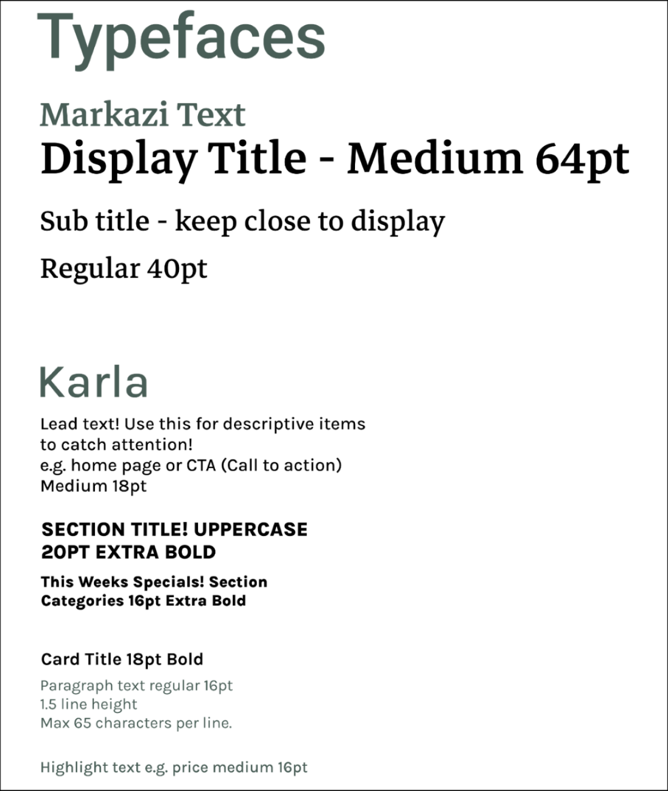 | 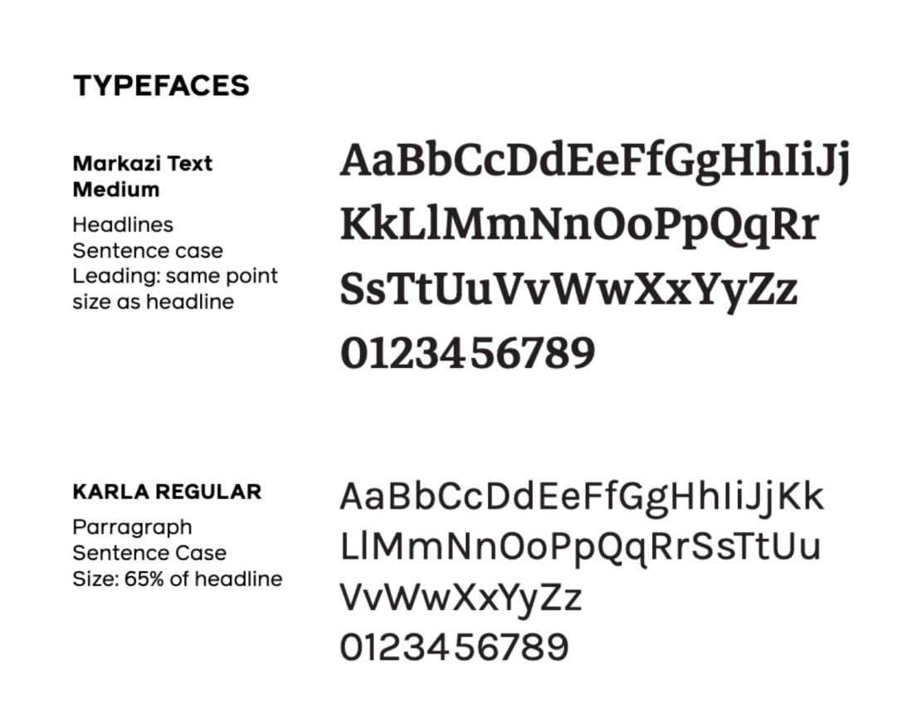 |
|:---:|:---:|

### Photo Guidelines
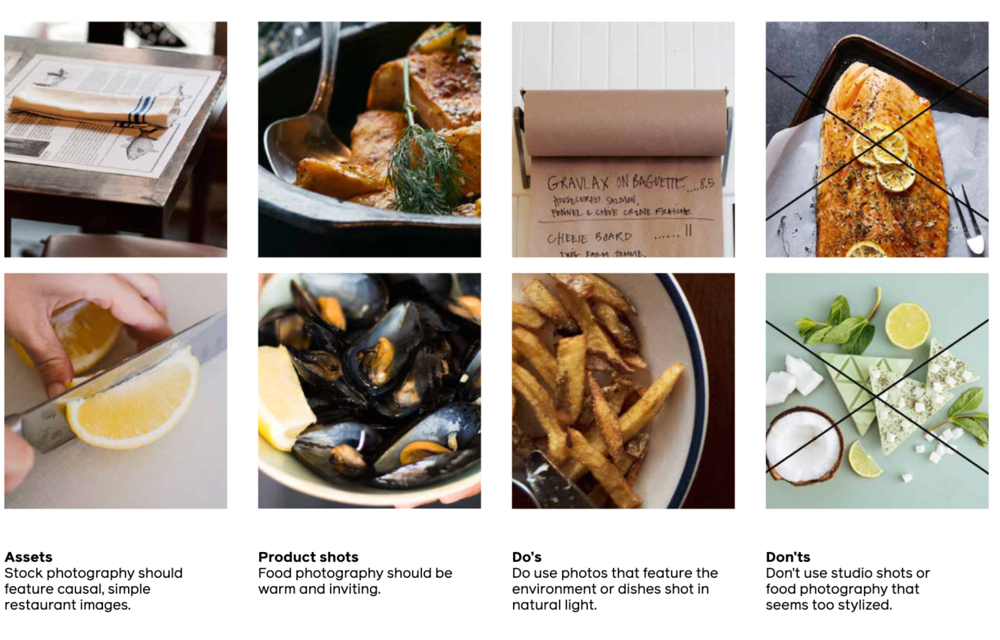

## Designs and Prototypes

### Onboarding, Home and User Profile screens 

| 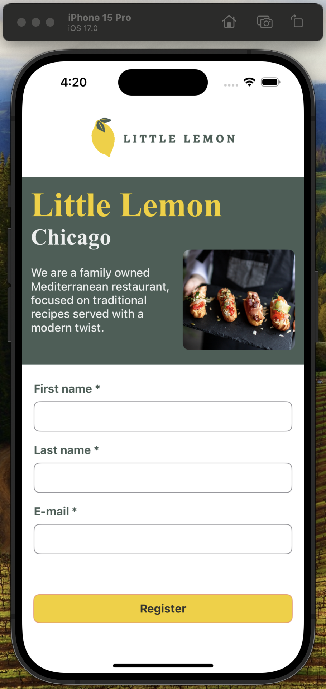 | 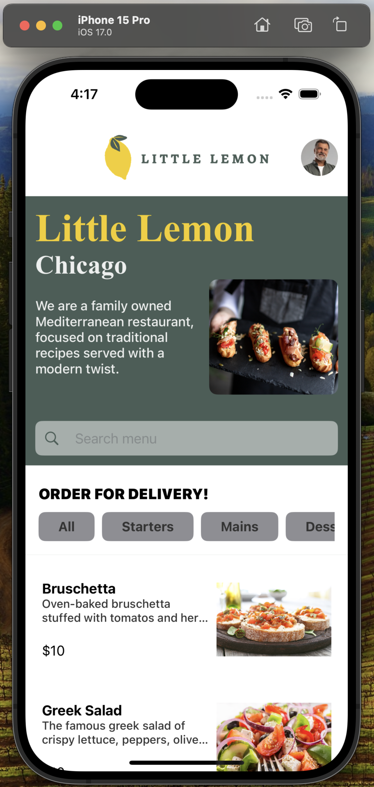 | 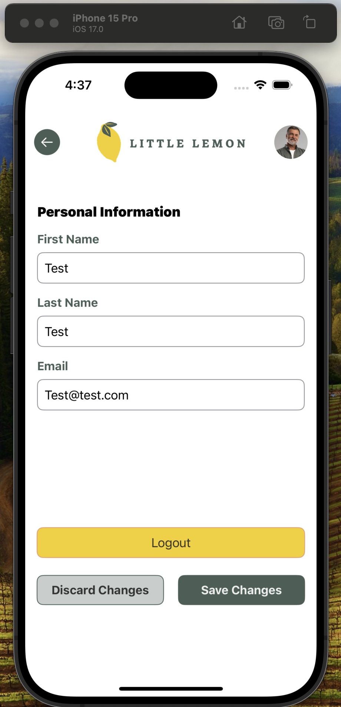  
|:---:|:---:|:---:|

## Designs and Prototypes of Proposed Features

### Menu items and Order screens

| 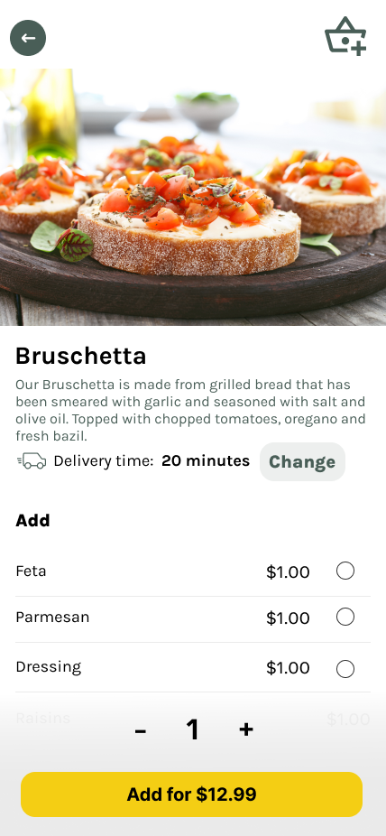 |  |
|:---:|:---:|

### Reservation / Book a table screens
| 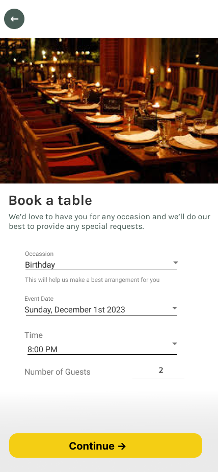 | 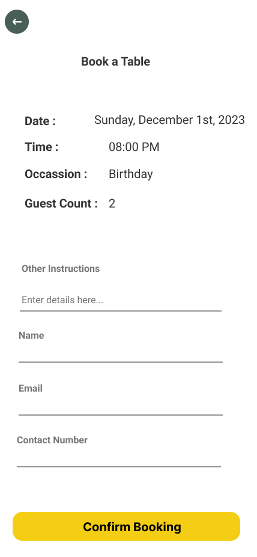 |
|:---:|:---:|

### Video Walthrough of Current App

The below video demostrates a walkthrough of the app and it's features.  
This was provided at the start of the readme, but is included for end of the readme as well for convenience.   
Click play on the below video to view the app features:

https://github.com/robcodehub/littlelemon/assets/50296456/ce17f36f-19aa-4540-ab52-11973b39fab6

