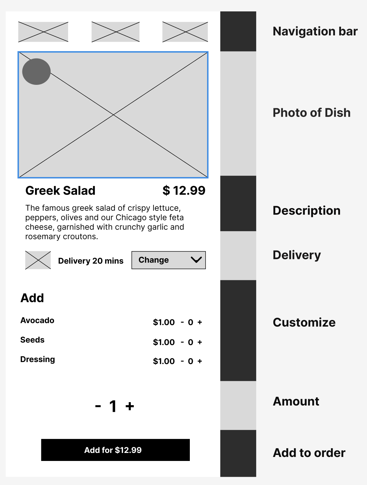
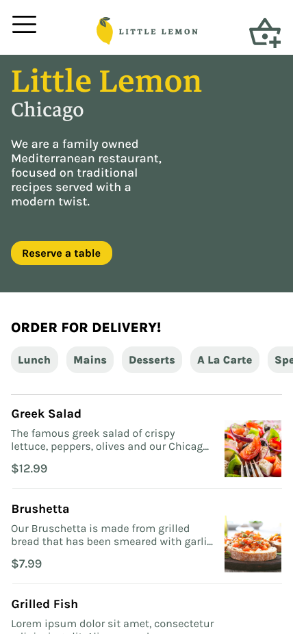
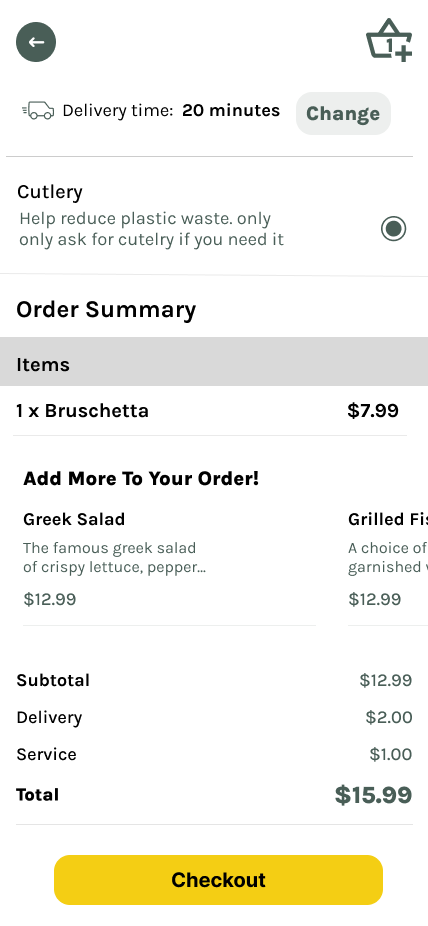

# Little Lemon iOS Capstone Project

## About the Brand

Little Lemon is a charming neighborhood bistro that serves simple food and classic cocktails in a lively but casual environment.  
The restaurant features a locally-sourced menu with daily specials.

## User Journey Map and Persona

### Persona

### Customer Journey Map

## Wireframes

## Style and Brand Guidelines

### Logo guide

### Color Palette

### Typography
|  |  |
|:---:|:---:|

### Photo Guidelines

## Designs and Prototypes

### Home, Menu items and Order screens

|  |  |  |
|:---:|:---:|:---:|

### Reservation / Book a table screens
|  |  |
|:---:|:---:|

